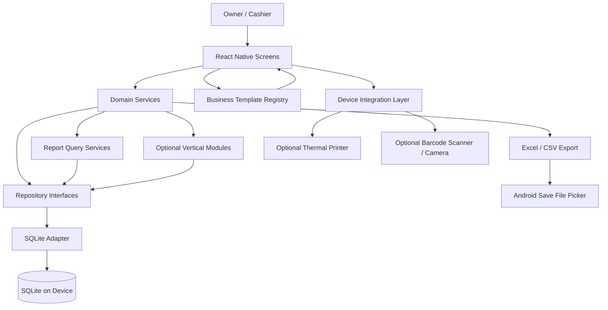
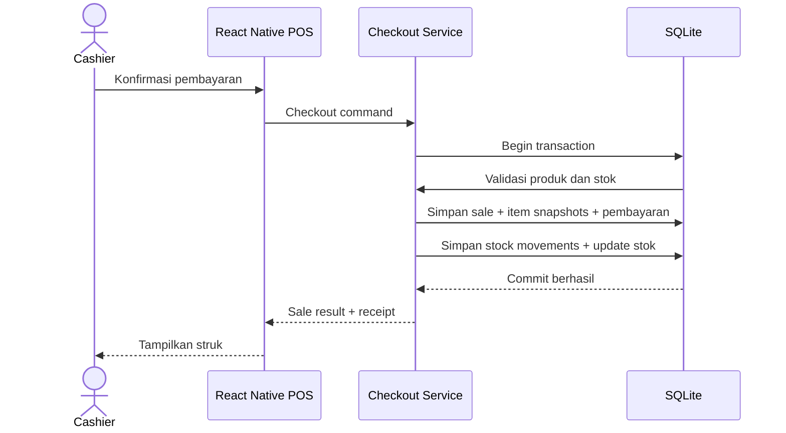

# Architecture — RavaPOS

**Versi:** 0.2 | **Status:** Draft

## 1. Ringkasan
MVP menggunakan arsitektur **native Android local-first** dengan React Native. SQLite lokal menjadi sumber data utama. Tidak ada backend, akun, cloud database, atau sinkronisasi pada tahap awal.

## 2. Diagram komponen


## 3. Data flow checkout

Jika operasi gagal sebelum commit, transaksi harus rollback. UI tidak boleh menampilkan sukses atau mengosongkan cart sebelum commit berhasil.

## 4. Batas tanggung jawab
- **Screens/UI:** presentasi, input, navigasi, feedback.
- **Domain services:** checkout, void, piutang, penyesuaian stok, laporan.
- **Repositories:** abstraksi query dan transaksi database.
- **SQLite adapter:** persistensi lokal dan migrasi.
- **Export service:** membentuk tabel Excel/CSV untuk produk, transaksi, pelanggan, dan pengeluaran.
- **Report services:** query/agregasi data lokal.
- **Business template registry:** istilah, kategori awal, satuan, modul aktif, dan layar awal berdasarkan profil vertikal.
- **Vertical modules:** lifecycle dan aturan khusus seperti tiket laundry, order kerja bengkel, antrean barbershop, atau alur meja/dapur F&B.
- **Device integration:** printer, barcode, file picker; dipisahkan agar implementasi native dapat diganti.

## 5. Struktur folder yang disarankan
```text
src/
  app/              # navigation, providers, bootstrap
  components/       # reusable UI
  features/
    setup/ catalog/ pos/ inventory/ customers/
    receivables/ expenses/ reports/ data-management/ settings/
  domain/           # business rules and use cases
  data/
    database/       # SQLite adapter, schema, migrations
    repositories/   # repository implementations
    exports/         # Excel and CSV generation
  device/           # printer, barcode, filesystem adapters
  hooks/
  lib/              # currency, date, ids, validation
  tests/
docs/
README.md
```

## 6. Architecture Decision Records
### ADR-001: React Native Android app, not PWA
**Decision:** build a native Android application with React Native + TypeScript.
**Rationale:** aligns with mobile-only product direction and provides a path to native device capabilities. Printer/barcode integrations still require device-level compatibility tests.
**Consequence:** release packaging, Android permissions, native dependency compatibility, and device QA become part of the project.

### ADR-002: SQLite as local database
**Decision:** use SQLite through a React Native-compatible library selected after a technical spike.
**Rationale:** relational data and transactional checkout fit the product's local-first requirements.
**Consequence:** migrations, backup consistency, and library/native compatibility must be tested. Do not choose a library until transaction and migration behavior are verified.

### ADR-003: No cloud sync in MVP
**Decision:** no backend or multi-device sync.
**Rationale:** reduces operating cost, scope, and conflict complexity for a low one-time price.
**Consequence:** dataset lives on one device; exported files can be read elsewhere but cannot be restored into the app.

### ADR-004: Atomic checkout and immutable history
**Decision:** write checkout in one SQLite transaction; corrections are recorded as void/refund events.
**Rationale:** maintain sale/stock consistency and traceability.

### ADR-005: One-time price is a hypothesis
**Decision:** test price around Rp119.000.
**Consequence:** define support/update limits and measure support cost before launch.

### ADR-006: Shared POS core with vertical business modules
**Decision:** reuse the offline catalog, checkout, customer, expense, report, and export foundation. Describe vertical defaults through a template registry; implement different business lifecycles as isolated modules.
**Rationale:** F&B, laundry, barbershop, and workshop jobs have materially different item, status, and fulfillment rules. A single generic checkout screen cannot represent those workflows safely.
**Consequence:** migrate the catalog to distinguish stock-tracked goods from services and define quantity precision before enabling service-heavy templates. The retail workflow remains the first supported profile until each vertical passes its own device and user testing.

## 7. Evolusi setelah validasi
1. Backend/API for cloud backup or accounts if demand is proven.
2. Sync queue, idempotency, and conflict policy before any multi-device sync.
3. Multi-cashier only after inventory consistency and device ownership are designed.
4. Expand printer/scanner support based on tested hardware, not broad compatibility assumptions.
